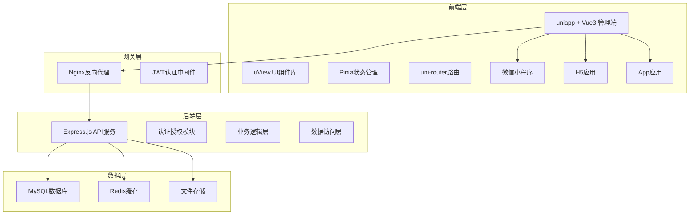

# 简庐管理后台系统设计文档

## 概述

简庐管理后台系统采用前后端分离的架构设计，前端使用uniapp + Vue3构建跨平台的管理界面（支持微信小程序、H5、App），后端使用Node.js + Express.js提供RESTful API服务，数据存储使用MySQL数据库。系统支持基于角色的权限控制(RBAC)，确保不同角色用户只能访问相应的功能模块。

## 架构

### 系统架构图



### 技术架构

**前端架构：**
- **框架**: uniapp + Vue3 with TypeScript
- **UI库**: uView UI 2.x
- **状态管理**: Pinia
- **路由**: uni-router
- **HTTP客户端**: uni.request封装
- **构建工具**: HBuilderX / Vite
- **代码规范**: ESLint + Prettier
- **平台支持**: 微信小程序、H5、App

**后端架构：**
- **运行时**: Node.js 18+
- **框架**: Express.js
- **认证**: JWT + bcrypt
- **数据库ORM**: Sequelize
- **缓存**: Redis
- **日志**: Winston
- **API文档**: Swagger/OpenAPI

**数据库架构：**
- **主数据库**: MySQL 8.0
- **缓存**: Redis 6.x
- **文件存储**: 本地存储/云存储

## 组件和接口

### 前端组件架构

```
src/
├── components/           # 通用组件
│   ├── Layout/          # 布局组件
│   ├── Auth/            # 认证组件
│   ├── Charts/          # 图表组件
│   └── Common/          # 通用UI组件
├── pages/               # 页面组件
│   ├── dashboard/       # 仪表板
│   ├── users/           # 用户管理
│   ├── teams/           # 团队管理
│   ├── activities/      # 活动管理
│   ├── content/         # 内容管理
│   └── settings/        # 系统设置
├── composables/         # Vue3 Composition API
├── api/                 # API服务
├── store/               # Pinia状态管理
├── utils/               # 工具函数
├── types/               # TypeScript类型定义
├── static/              # 静态资源
├── uni_modules/         # uni-app插件
├── manifest.json        # 应用配置
├── pages.json           # 页面路由配置
└── App.vue              # 应用入口
```

### 核心组件设计

**1. 布局组件 (Layout)**
```vue
<template>
  <view class="layout">
    <!-- 顶部导航栏 -->
    <u-navbar :title="title" :border="false">
      <template #left>
        <u-icon name="arrow-left" @click="goBack" v-if="showBack"></u-icon>
      </template>
      <template #right>
        <u-avatar :src="userInfo.avatar" size="small" @click="showUserMenu"></u-avatar>
      </template>
    </u-navbar>
    
    <!-- 主内容区 -->
    <view class="content">
      <slot></slot>
    </view>
    
    <!-- 底部导航（小程序端） -->
    <u-tabbar v-if="isWeChat" :list="tabbarList" :current="current"></u-tabbar>
  </view>
</template>

<script setup lang="ts">
interface LayoutProps {
  title?: string;
  showBack?: boolean;
  showTabbar?: boolean;
}

// 功能：
// - 响应式顶部导航栏
// - 用户信息展示和菜单
// - 条件性底部导航（小程序）
// - 基于权限的菜单项显示
</script>
```

**2. 权限控制组件 (PermissionGuard)**
```vue
<template>
  <view v-if="hasPermission">
    <slot></slot>
  </view>
  <view v-else-if="$slots.fallback">
    <slot name="fallback"></slot>
  </view>
</template>

<script setup lang="ts">
interface PermissionGuardProps {
  permission: string | string[];
  mode?: 'all' | 'any'; // 多权限时的验证模式
}

const props = withDefaults(defineProps<PermissionGuardProps>(), {
  mode: 'any'
});

// 功能：
// - 基于用户权限控制组件渲染
// - 支持单个或多个权限验证
// - 支持页面级和操作级权限控制
// - 提供fallback插槽
</script>
```

**3. 数据列表组件 (DataList)**
```vue
<template>
  <view class="data-list">
    <!-- 搜索栏 -->
    <u-search 
      v-model="searchKeyword" 
      placeholder="搜索..." 
      @search="handleSearch"
      @clear="handleClear"
    ></u-search>
    
    <!-- 筛选器 -->
    <view class="filter-bar" v-if="showFilter">
      <u-dropdown ref="dropdown">
        <u-dropdown-item 
          v-for="filter in filters" 
          :key="filter.key"
          :title="filter.title"
          :options="filter.options"
          @change="handleFilterChange"
        ></u-dropdown-item>
      </u-dropdown>
    </view>
    
    <!-- 列表内容 -->
    <u-list @scrolltolower="loadMore" :loading="loading">
      <u-list-item 
        v-for="item in dataList" 
        :key="item.id"
        @click="handleItemClick(item)"
      >
        <slot name="item" :item="item"></slot>
      </u-list-item>
    </u-list>
    
    <!-- 批量操作 -->
    <u-action-sheet 
      v-model="showBatchActions" 
      :actions="batchActions"
      @select="handleBatchAction"
    ></u-action-sheet>
  </view>
</template>

<script setup lang="ts">
interface DataListProps<T> {
  data: T[];
  loading?: boolean;
  searchable?: boolean;
  filterable?: boolean;
  batchable?: boolean;
  pagination?: PaginationConfig;
}

// 功能：
// - 数据展示和下拉刷新
// - 搜索和筛选
// - 批量操作
// - 无限滚动加载
// - 自定义列表项模板
</script>
```

### 后端API接口设计

**1. 认证接口**
```typescript
// POST /api/auth/login
interface LoginRequest {
  username: string;
  password: string;
  rememberMe?: boolean;
}

interface LoginResponse {
  token: string;
  user: {
    id: string;
    username: string;
    role: string;
    permissions: string[];
  };
  expiresIn: number;
}

// POST /api/auth/refresh
// GET /api/auth/profile
// POST /api/auth/logout
```

**2. 用户管理接口**
```typescript
// GET /api/users
interface GetUsersQuery {
  page?: number;
  limit?: number;
  search?: string;
  status?: 'active' | 'inactive';
  role?: string;
  startDate?: string;
  endDate?: string;
}

// POST /api/users
interface CreateUserRequest {
  username: string;
  email: string;
  password: string;
  role: string;
  profile: UserProfile;
}

// PUT /api/users/:id
// DELETE /api/users/:id
// POST /api/users/batch
```

**3. 团队管理接口**
```typescript
// GET /api/teams
// POST /api/teams
// PUT /api/teams/:id
// DELETE /api/teams/:id
// GET /api/teams/:id/members
// POST /api/teams/:id/members
// DELETE /api/teams/:id/members/:userId
```

**4. 活动管理接口**
```typescript
// GET /api/activities
// POST /api/activities
// PUT /api/activities/:id
// DELETE /api/activities/:id
// POST /api/activities/:id/approve
// POST /api/activities/:id/reject
```

**5. 内容管理接口**
```typescript
// GET /api/content/diaries
// PUT /api/content/diaries/:id/status
// GET /api/content/comments
// DELETE /api/content/comments/:id
// POST /api/content/reports/:id/handle
```

## 数据模型

### 数据库表设计

**1. 用户表 (users)**
```sql
CREATE TABLE users (
  id VARCHAR(36) PRIMARY KEY,
  username VARCHAR(50) UNIQUE NOT NULL,
  email VARCHAR(100) UNIQUE NOT NULL,
  password_hash VARCHAR(255) NOT NULL,
  role ENUM('super_admin', 'system_admin', 'operation_admin', 'team_admin') NOT NULL,
  status ENUM('active', 'inactive', 'deleted') DEFAULT 'active',
  profile JSON,
  last_login_at TIMESTAMP NULL,
  login_attempts INT DEFAULT 0,
  locked_until TIMESTAMP NULL,
  created_at TIMESTAMP DEFAULT CURRENT_TIMESTAMP,
  updated_at TIMESTAMP DEFAULT CURRENT_TIMESTAMP ON UPDATE CURRENT_TIMESTAMP,
  INDEX idx_username (username),
  INDEX idx_email (email),
  INDEX idx_role (role),
  INDEX idx_status (status)
);
```

**2. 团队表 (teams)**
```sql
CREATE TABLE teams (
  id VARCHAR(36) PRIMARY KEY,
  name VARCHAR(100) NOT NULL,
  description TEXT,
  avatar_url VARCHAR(255),
  creator_id VARCHAR(36) NOT NULL,
  status ENUM('active', 'inactive', 'dissolved') DEFAULT 'active',
  member_count INT DEFAULT 0,
  activity_count INT DEFAULT 0,
  created_at TIMESTAMP DEFAULT CURRENT_TIMESTAMP,
  updated_at TIMESTAMP DEFAULT CURRENT_TIMESTAMP ON UPDATE CURRENT_TIMESTAMP,
  FOREIGN KEY (creator_id) REFERENCES users(id),
  INDEX idx_creator (creator_id),
  INDEX idx_status (status),
  INDEX idx_created_at (created_at)
);
```

**3. 团队成员表 (team_members)**
```sql
CREATE TABLE team_members (
  id VARCHAR(36) PRIMARY KEY,
  team_id VARCHAR(36) NOT NULL,
  user_id VARCHAR(36) NOT NULL,
  role ENUM('admin', 'member') DEFAULT 'member',
  joined_at TIMESTAMP DEFAULT CURRENT_TIMESTAMP,
  FOREIGN KEY (team_id) REFERENCES teams(id) ON DELETE CASCADE,
  FOREIGN KEY (user_id) REFERENCES users(id) ON DELETE CASCADE,
  UNIQUE KEY uk_team_user (team_id, user_id),
  INDEX idx_team (team_id),
  INDEX idx_user (user_id)
);
```

**4. 活动表 (activities)**
```sql
CREATE TABLE activities (
  id VARCHAR(36) PRIMARY KEY,
  title VARCHAR(200) NOT NULL,
  description TEXT,
  cover_url VARCHAR(255),
  team_id VARCHAR(36) NOT NULL,
  creator_id VARCHAR(36) NOT NULL,
  start_time TIMESTAMP NOT NULL,
  end_time TIMESTAMP NOT NULL,
  location VARCHAR(255),
  max_participants INT,
  current_participants INT DEFAULT 0,
  status ENUM('draft', 'published', 'ongoing', 'completed', 'cancelled') DEFAULT 'draft',
  approval_status ENUM('pending', 'approved', 'rejected') DEFAULT 'pending',
  created_at TIMESTAMP DEFAULT CURRENT_TIMESTAMP,
  updated_at TIMESTAMP DEFAULT CURRENT_TIMESTAMP ON UPDATE CURRENT_TIMESTAMP,
  FOREIGN KEY (team_id) REFERENCES teams(id),
  FOREIGN KEY (creator_id) REFERENCES users(id),
  INDEX idx_team (team_id),
  INDEX idx_creator (creator_id),
  INDEX idx_status (status),
  INDEX idx_start_time (start_time)
);
```

**5. 日记表 (diaries)**
```sql
CREATE TABLE diaries (
  id VARCHAR(36) PRIMARY KEY,
  user_id VARCHAR(36) NOT NULL,
  title VARCHAR(200),
  content TEXT NOT NULL,
  tags JSON,
  images JSON,
  mood ENUM('happy', 'sad', 'angry', 'excited', 'calm', 'anxious'),
  is_public BOOLEAN DEFAULT FALSE,
  status ENUM('draft', 'published', 'reviewed', 'rejected', 'deleted') DEFAULT 'published',
  review_status ENUM('pending', 'approved', 'rejected') DEFAULT 'pending',
  review_reason TEXT,
  created_at TIMESTAMP DEFAULT CURRENT_TIMESTAMP,
  updated_at TIMESTAMP DEFAULT CURRENT_TIMESTAMP ON UPDATE CURRENT_TIMESTAMP,
  FOREIGN KEY (user_id) REFERENCES users(id),
  INDEX idx_user (user_id),
  INDEX idx_status (status),
  INDEX idx_created_at (created_at)
);
```

**6. 系统配置表 (system_configs)**
```sql
CREATE TABLE system_configs (
  id VARCHAR(36) PRIMARY KEY,
  key_name VARCHAR(100) UNIQUE NOT NULL,
  value JSON NOT NULL,
  description TEXT,
  category VARCHAR(50),
  created_at TIMESTAMP DEFAULT CURRENT_TIMESTAMP,
  updated_at TIMESTAMP DEFAULT CURRENT_TIMESTAMP ON UPDATE CURRENT_TIMESTAMP,
  INDEX idx_category (category)
);
```

**7. 操作日志表 (audit_logs)**
```sql
CREATE TABLE audit_logs (
  id VARCHAR(36) PRIMARY KEY,
  user_id VARCHAR(36),
  action VARCHAR(100) NOT NULL,
  resource_type VARCHAR(50) NOT NULL,
  resource_id VARCHAR(36),
  details JSON,
  ip_address VARCHAR(45),
  user_agent TEXT,
  created_at TIMESTAMP DEFAULT CURRENT_TIMESTAMP,
  FOREIGN KEY (user_id) REFERENCES users(id),
  INDEX idx_user (user_id),
  INDEX idx_action (action),
  INDEX idx_resource (resource_type, resource_id),
  INDEX idx_created_at (created_at)
);
```

## 错误处理

### 前端错误处理策略

**1. HTTP错误处理**
```typescript
// uni.request封装统一处理HTTP错误
class HttpClient {
  private baseURL = process.env.VUE_APP_API_BASE_URL;
  
  async request(options: UniApp.RequestOptions) {
    const token = uni.getStorageSync('token');
    
    const requestOptions: UniApp.RequestOptions = {
      ...options,
      url: this.baseURL + options.url,
      header: {
        'Content-Type': 'application/json',
        'Authorization': token ? `Bearer ${token}` : '',
        ...options.header
      }
    };

    try {
      const [error, response] = await uni.request(requestOptions);
      
      if (error) {
        throw new Error('网络请求失败');
      }

      const { statusCode, data } = response;
      
      switch (statusCode) {
        case 401:
          // 未授权，清除token并跳转登录页
          uni.removeStorageSync('token');
          uni.reLaunch({ url: '/pages/login/login' });
          throw new Error('登录已过期，请重新登录');
        case 403:
          uni.showToast({ title: '权限不足', icon: 'none' });
          throw new Error('权限不足');
        case 500:
          uni.showToast({ title: '服务器错误，请稍后重试', icon: 'none' });
          throw new Error('服务器错误');
        default:
          if (statusCode >= 400) {
            const errorMessage = data?.message || '请求失败';
            uni.showToast({ title: errorMessage, icon: 'none' });
            throw new Error(errorMessage);
          }
      }

      return data;
    } catch (error) {
      console.error('HTTP Request Error:', error);
      throw error;
    }
  }
}

export const http = new HttpClient();
```

**2. 全局错误处理**
```typescript
// main.ts 中配置全局错误处理
import { createApp } from 'vue';
import App from './App.vue';

const app = createApp(App);

// 全局错误处理
app.config.errorHandler = (error, instance, info) => {
  console.error('Global Error:', error, info);
  
  // 上报错误到监控系统
  if (process.env.NODE_ENV === 'production') {
    // 错误上报逻辑
  }
  
  // 显示用户友好的错误提示
  uni.showToast({
    title: '系统异常，请稍后重试',
    icon: 'none'
  });
};

// Promise 未捕获错误处理
window.addEventListener('unhandledrejection', (event) => {
  console.error('Unhandled Promise Rejection:', event.reason);
  event.preventDefault();
});
```

### 后端错误处理策略

**1. 统一错误处理中间件**
```typescript
interface ApiError extends Error {
  statusCode: number;
  code: string;
}

const errorHandler = (err: ApiError, req: Request, res: Response, next: NextFunction) => {
  const statusCode = err.statusCode || 500;
  const message = err.message || 'Internal Server Error';
  
  // 记录错误日志
  logger.error({
    error: err.message,
    stack: err.stack,
    url: req.url,
    method: req.method,
    ip: req.ip,
    userAgent: req.get('User-Agent')
  });

  res.status(statusCode).json({
    success: false,
    code: err.code || 'INTERNAL_ERROR',
    message,
    ...(process.env.NODE_ENV === 'development' && { stack: err.stack })
  });
};
```

**2. 业务错误类定义**
```typescript
export class ValidationError extends Error {
  statusCode = 400;
  code = 'VALIDATION_ERROR';
}

export class AuthenticationError extends Error {
  statusCode = 401;
  code = 'AUTHENTICATION_ERROR';
}

export class AuthorizationError extends Error {
  statusCode = 403;
  code = 'AUTHORIZATION_ERROR';
}

export class NotFoundError extends Error {
  statusCode = 404;
  code = 'NOT_FOUND';
}
```

## 测试策略

### 前端测试

**1. 单元测试 (Jest + Vue Test Utils)**
```typescript
// 组件测试示例
import { mount } from '@vue/test-utils';
import { describe, it, expect, vi } from 'vitest';
import UserList from '@/components/UserList.vue';

describe('UserList Component', () => {
  it('should render user list correctly', () => {
    const mockUsers = [
      { id: '1', username: 'test1', email: 'test1@example.com' }
    ];
    
    const wrapper = mount(UserList, {
      props: { users: mockUsers }
    });
    
    expect(wrapper.text()).toContain('test1');
    expect(wrapper.text()).toContain('test1@example.com');
  });

  it('should handle user deletion', async () => {
    const mockOnDelete = vi.fn();
    const wrapper = mount(UserList, {
      props: { 
        users: mockUsers,
        onDelete: mockOnDelete 
      }
    });
    
    await wrapper.find('[data-testid="delete-button"]').trigger('click');
    
    expect(mockOnDelete).toHaveBeenCalledWith('1');
  });
});
```

**2. Composables测试**
```typescript
// Composition API测试
import { describe, it, expect, beforeEach } from 'vitest';
import { useUsers } from '@/composables/useUsers';

describe('useUsers Composable', () => {
  beforeEach(() => {
    // Mock uni.request
    global.uni = {
      request: vi.fn()
    };
  });

  it('should fetch users successfully', async () => {
    const mockResponse = {
      data: {
        success: true,
        data: [
          { id: '1', username: 'test1' },
          { id: '2', username: 'test2' }
        ]
      }
    };

    vi.mocked(uni.request).mockResolvedValue([null, mockResponse]);

    const { users, loading, fetchUsers } = useUsers();
    
    await fetchUsers();
    
    expect(users.value).toHaveLength(2);
    expect(loading.value).toBe(false);
  });
});
```

**3. 小程序端测试**
```typescript
// 小程序特定功能测试
describe('WeChat MiniProgram Features', () => {
  it('should handle wx.login correctly', async () => {
    // Mock wx API
    global.wx = {
      login: vi.fn().mockImplementation((options) => {
        options.success({ code: 'mock-code' });
      })
    };

    const { wxLogin } = useWxAuth();
    const result = await wxLogin();
    
    expect(result.code).toBe('mock-code');
    expect(wx.login).toHaveBeenCalled();
  });
});
```

### 后端测试

**1. 单元测试 (Jest)**
```typescript
describe('UserService', () => {
  describe('createUser', () => {
    it('should create user successfully', async () => {
      const userData = {
        username: 'testuser',
        email: 'test@example.com',
        password: 'password123'
      };

      const user = await UserService.createUser(userData);

      expect(user.username).toBe('testuser');
      expect(user.email).toBe('test@example.com');
      expect(user.password).not.toBe('password123'); // 应该被加密
    });

    it('should throw error for duplicate username', async () => {
      const userData = {
        username: 'existing',
        email: 'test@example.com',
        password: 'password123'
      };

      await expect(UserService.createUser(userData))
        .rejects.toThrow('用户名已存在');
    });
  });
});
```

**2. API测试 (Supertest)**
```typescript
describe('POST /api/users', () => {
  it('should create user with valid data', async () => {
    const userData = {
      username: 'newuser',
      email: 'new@example.com',
      password: 'password123',
      role: 'team_admin'
    };

    const response = await request(app)
      .post('/api/users')
      .set('Authorization', `Bearer ${adminToken}`)
      .send(userData)
      .expect(201);

    expect(response.body.success).toBe(true);
    expect(response.body.data.username).toBe('newuser');
  });

  it('should return 400 for invalid data', async () => {
    const invalidData = {
      username: '',
      email: 'invalid-email'
    };

    await request(app)
      .post('/api/users')
      .set('Authorization', `Bearer ${adminToken}`)
      .send(invalidData)
      .expect(400);
  });
});
```

### 端到端测试 (Playwright)

```typescript
test('admin can manage users', async ({ page }) => {
  // 登录
  await page.goto('/login');
  await page.fill('[data-testid=username]', 'admin');
  await page.fill('[data-testid=password]', 'password');
  await page.click('[data-testid=login-button]');

  // 导航到用户管理
  await page.click('text=用户管理');
  await expect(page).toHaveURL('/users');

  // 创建新用户
  await page.click('text=新增用户');
  await page.fill('[data-testid=username]', 'testuser');
  await page.fill('[data-testid=email]', 'test@example.com');
  await page.fill('[data-testid=password]', 'password123');
  await page.selectOption('[data-testid=role]', 'team_admin');
  await page.click('[data-testid=submit]');

  // 验证用户创建成功
  await expect(page.locator('text=testuser')).toBeVisible();
});
```